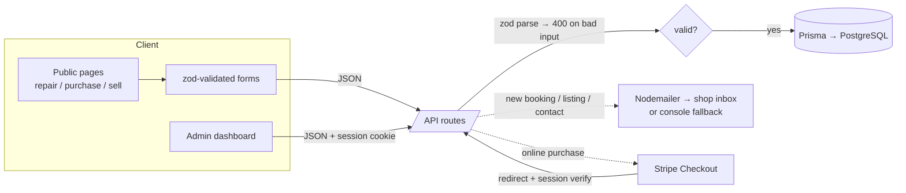
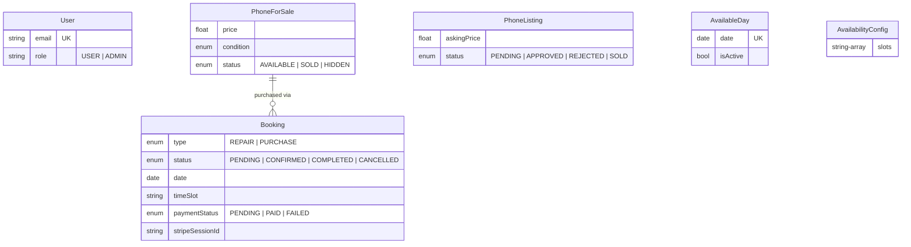

# iRescue Athens

A full-stack storefront for a phone repair & resale business in Athens: customers book repairs with up-front pricing, buy refurbished devices (with optional online payment), and submit trade-in offers — staff manage everything from an admin dashboard.


## Features

- **Repair booking** — pick a brand, model and issue from a published price list (100+ models), then book a time slot on a live availability calendar. Double-booked slots are rejected server-side.
- **Refurbished store** — filterable catalog with condition badges and photo galleries. Customers reserve a pickup slot and either pay in store or pay immediately via **Stripe Checkout** (test mode).
- **Sell / trade-in flow** — multi-step form with photo upload; staff review requests and respond with offers.
- **Admin dashboard** — stat cards, bookings with status workflow, sell-request review, inventory CRUD with image upload, and calendar/slot management. Protected by NextAuth with role-based access.
- **Email notifications** — the shop is notified about new bookings, purchases, sell requests and contact messages. Degrades gracefully: without SMTP credentials, emails are logged to the console.
- **Validated APIs** — every endpoint validates input with zod and returns field-level errors; internal errors are never leaked to clients.

## Screenshots

> _Placeholder — capture these pages for the gallery:_
> 1. Landing page (hero + journey cards) — `/`
> 2. Repair flow, issue-selection step with prices — `/repair`
> 3. Repair flow, calendar & slot picker — `/repair` (step 4)
> 4. Refurbished catalog with filters — `/purchase`
> 5. Phone detail modal with gallery — `/purchase`
> 6. Stripe Checkout page (test mode) — via "Pay online now"
> 7. Sell flow, photos & price step — `/sell`
> 8. Admin dashboard with stat cards — `/admin`
> 9. Admin bookings table with status change — `/admin/bookings`
> 10. Mobile navigation (360 px viewport) — any page

## Tech stack

| Layer | Choice |
|---|---|
| Framework | Next.js 15 (App Router, React 19, TypeScript strict) |
| Database | PostgreSQL via Prisma ORM |
| Auth | NextAuth (credentials provider, JWT sessions, role claim) |
| Payments | Stripe Checkout (test mode, optional) |
| Styling | Tailwind CSS with a custom token-based design system |
| Validation | zod, shared between client forms and API routes |
| Email | Nodemailer (console fallback when unconfigured) |

## Architecture



**Request flow for an online purchase:** the client posts to `/api/purchases`; the server validates the payload, re-reads the price from the database (never trusting the client), creates a `PENDING` booking and a Stripe Checkout session, and returns the checkout URL. After payment, Stripe redirects to `/payment/success?session_id=…`, which calls `/api/checkout/verify`; the server confirms `payment_status === "paid"` with Stripe, marks the booking `PAID`/`CONFIRMED` and the phone `SOLD` (idempotently).

**Data model (simplified):**



## Quick start

Prerequisites: Node 20+ (24 recommended, see `.nvmrc`) and Docker (for the local database).

```bash
# 1. Configuration
cp .env.example .env        # defaults work with the bundled database

# 2. Local PostgreSQL
npm run db:up               # docker compose up -d

# 3. Install, migrate, seed — one command
npm run setup

# 4. Run
npm run dev                 # http://localhost:3000
```

No Docker? Point `DATABASE_URL` in `.env` at any PostgreSQL instance and run `npm run setup`.

### Demo credentials

The seed creates a **demo-only** admin account for exploring the dashboard at [`/admin`](http://localhost:3000/admin):

| Email | Password |
|---|---|
| `admin@demo.com` | `demo-admin-123` |

> Demo data (phones, bookings, sell requests) is reset every time the seed runs (`npm run db:seed`).

### Testing Stripe payments

Set `STRIPE_SECRET_KEY` in `.env` to a Stripe **test** key, restart the dev server, and the "Pay online now" option appears in the purchase flow. Use Stripe's standard test cards:

| Card number | Result |
|---|---|
| `4242 4242 4242 4242` | Payment succeeds |
| `4000 0000 0000 0002` | Payment declined |

Any future expiry date and any CVC work. Without a Stripe key the option is hidden and purchases fall back to pay-in-store.

## Environment variables

| Variable | Required | Description |
|---|---|---|
| `DATABASE_URL` | ✅ | PostgreSQL connection string |
| `NEXTAUTH_URL` | ✅ | Base URL of the app (`http://localhost:3000` locally) |
| `NEXTAUTH_SECRET` | ✅ | Session-signing secret — `openssl rand -base64 32` |
| `NEXT_PUBLIC_SITE_URL` | — | Public base URL used in emails and Stripe redirects (defaults to localhost) |
| `EMAIL_USER` / `EMAIL_PASSWORD` | — | SMTP credentials; unset → emails are logged to the console |
| `EMAIL_HOST` / `EMAIL_PORT` / `EMAIL_SECURE` | — | SMTP server settings (default: Gmail on 587). Gmail requires an [App Password](https://myaccount.google.com/apppasswords) |
| `EMAIL_RECEIVER` | — | Notification recipient (defaults to `EMAIL_USER`) |
| `STRIPE_SECRET_KEY` | — | Stripe test secret key; unset → online payment hidden |

## Project structure

```
prisma/              schema, migrations, demo seed
src/
  app/
    (site)/          public pages (landing, repair, purchase, sell, …)
    admin/           dashboard, bookings, sell requests, inventory, availability
    api/             route handlers (zod-validated, admin routes session-guarded)
  components/
    ui/              design-system primitives (Button, Card, Modal, Table, …)
    layout/          Navbar, Footer, Logo
    booking/         shared calendar + scheduling form
  lib/               prisma client, auth, email, stripe, validation, formatting,
                     repair price catalog, site config
  types/             NextAuth session type augmentation
```

## Deployment notes

The app is a standard Next.js server build (`npm run build` → `npm start`) and runs anywhere Node 20+ and PostgreSQL are available (Vercel, Railway, Fly.io, a VPS…). Points worth knowing:

- Run `prisma migrate deploy` against the production database before the first start (and on schema changes).
- Set all required env vars from the table above; generate a fresh `NEXTAUTH_SECRET` per environment.
- Image uploads are stored on local disk under `public/uploads/` — swap this for object storage (S3, R2, Supabase Storage) on serverless hosts, where the filesystem is ephemeral.
- Online payments verify the Stripe Checkout session on redirect, which needs no extra infrastructure; for production-grade robustness add a Stripe webhook for `checkout.session.completed` as well.

## License

[MIT](./LICENSE)
